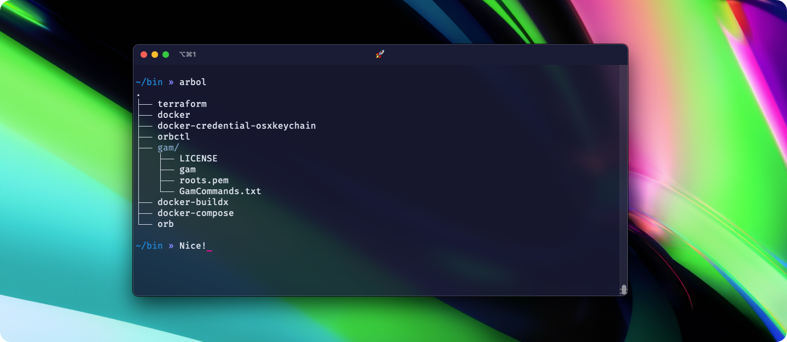

# Arbol



Arbol, a simple Command-Line Interface (CLI) tool to pretty-print the directory structure as an ASCII tree. Developed in Go, the tool provides an easy way to visualize the layout of files and directories, optionally including metadata such as file size and modification time.

## Features

- Prints the directory tree starting from the current directory or a specified directory.
- Options for verbose output to display file size and last modification time.
- Color-coded output to easily distinguish between files and directories.

## Prerequisites

- [Go](https://golang.org/) 1.14 or higher

## Quick Start

### Build from Source

1. Clone the repository:

    ```bash
    git clone https://github.com/arivictor/arbol.git
    ```

2. Navigate into the project directory:

    ```bash
    cd arbol
    ```

3. Build the project:

    ```bash
    go build
    ```

4. Optionally, move the compiled binary to a location in your PATH:

    ```bash
    sudo mv arbol /usr/local/bin/
    ```

## Usage

Run the command without any arguments to print the directory structure of the current directory:

```bash
./arbol
```

You can specify a directory to start from:

```bash
./arbol /path/to/directory
```

### Options

- `--verbose` or `-v`: Display file metadata (size and last modification time).

    ```bash
    ./arbol --verbose
    ```

## Contributing

Contributions are welcome! Feel free to submit a pull request.

## License

This project is licensed under the MIT License - see the [LICENSE.md](LICENSE.md) file for details.

---

Feel free to adapt this to fit the specific features or characteristics of your project!